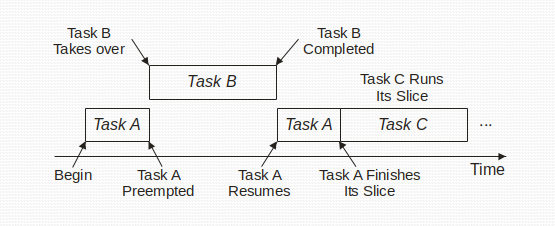
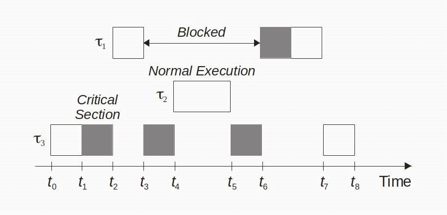
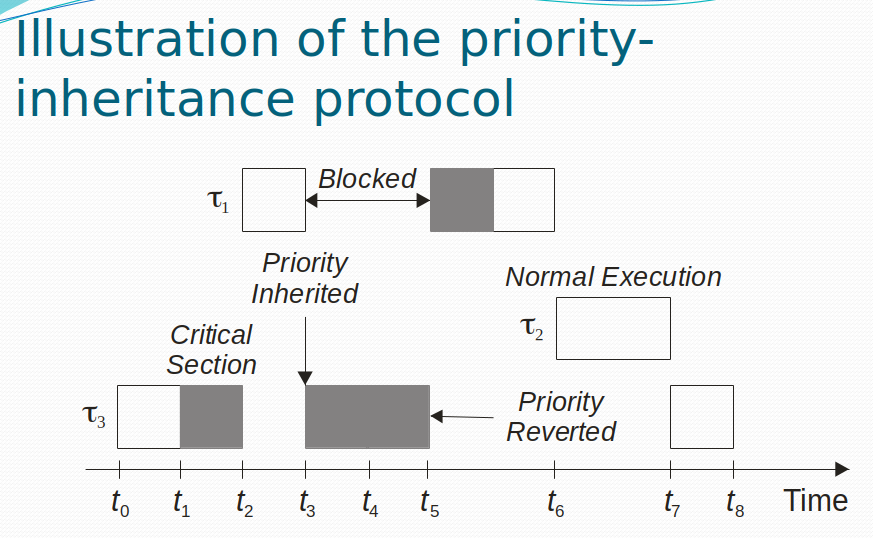

# Real-time Embedded Systems

# Background Processing

Can you have concurrency without parallelism and can you have parallelism without concurrency?

## Pre-emption

Context Switching - background process will be running and higher priority process will run and do a context switch.

## Context Switch

To save our data, save the state where everything is but also save where you are in the program, when a context switch happens, then nothing is running, so we keep it to a minimum.

Rate-monotonic and earliest deadline first.

# Initialization

- Initialization of the foreground/background system:
    - Disable interrupts
    - Set up interrupt vectors and stacks
    - Perform self-test
    - Perform system initialization
    - Enable interrupts

## Real-time OS

- Memory management
    - Paging
- Task Control Block Model
    - It is a data structure that stores the context of a task
    - The context includes the registers, program counter, other resources that the task might have
    - So that we can be able to do a context switch and so that the information can be stored off

## Task Control Block Model

- the OS manages TCBs
- Task Identifier, Priority, Status, Work Registers, Program Counter, Status Registers, Stack Pointer, and pointer to Next TCB
- Ready, Executing, Suspended, Terminated or Dormant
- Waiting for a semaphore is a blocking call
- **Understand what each task is and how to get from one state to the next**
- It's a data structure in memory that keeps track of their own resources
- As a new task gets loaded, then a new task control block gets created
- There's no explicit limitation on the tasks you can create

# Buffering Data

- Double buffering - ping pong buffering
- You have to keep track of which buffer you're reading from
- Tasks not finishing on time

## Synchronization Problem

- Producer and consumer problem (we can't control rate of producing and consuming)
- Time Relative Buffering can also be a way to solve this problem
    - Double buffering configuration, Two identical buffers are filled and emptied by alternating tasks. Switching is accomplished either by a software pointer or hardware discrete
- Reader's Writer's Problem

## Ring Buffers

- A circular queue or ring buffer can be used to solve the problem of synchronizing multiple reader and writer tasks
- Ring buffers are easier to manage

## Mailboxes

- A mutually agreed upon memory location that one or more tasks can use to pass data, or more generally for synchronization
- Tasks rely on the kernel to allow them to write to the location via a `post` operation or to read from it via a `pend` operation
- The difference between the pend operation and polling is that the pending tasks is suspended while waiting for data to appear — eliminates the busy waiting condition
- Mailboxes are available in most commercial RTOS
- 

# Semaphores

Task 1 has 3 tasks to be run before Task 2 runs.

# Task Characteristics of Real Workloads

- A task is something that is running
- These are tasks that run at a fixed rate
- Real time tasks are periodic - its task deadline is periodic to its frame

- Cache misses affect determinism
- We don't know when cache misses are going to happen

## Round-robin scheduling

- Fixed priority scheduling
- Goes from one task to another in a certain interval
- Each task will get 4ms
- **If a task takes longer than 4ms, then it will get pre-empted**
- The scheulder's main job is to decide who gets to run next (there is a timer that determines when scheduler wakes up and different tasks are run)
- If **tasks are more important than others** then it will take a much longer time to get to it, as it will **need to wait. This is a disadvantage of round-robin scheduling.**

## Cyclic executive

- One task runs for a set amount of time, then the next task is run
- Cyclic executive has minor frames and major frames - the amount of time it takes for all the tasks to complete
- We need to know what **task execution time is.** WCET - worse case execution time. We run tests and we give a system a workload and we time it
- Hyper period - least common multiple of how long the task needs to execute
- For 3 tasks t1=10,t2=25,and t3=50, gcd is 50 because each task needs to finish within 50Hz
- Cyclic executives are a form of multitasking

If tasks can't complete in this amount of time, then...

- Get a faster processor, or get the task offloaded and running in parallel
- If these tasks are dependent on each other, then you need some way to transfer comms between them
- **If we add up the utilization, and if the thing is greater than 0.7, then we will not meet deadlines**
- execution time divided by period to get utilization

# Earliest deadline first

- Earliest deadline is an optimal algorithm that is dynamic not static
- Priorities change, which is why it is a dynamic earlisest deadline approach
- Task with the earliest deadline has the highest proriority
- sum of (execution  / period) ≥ 1 then cannot schedule
- Deadlines are the same as period

# Critical Regions

- Multitasking systems are concerned with resource sharing
- Multiple tasks are sharing resources, but there is a case where we need to be careful
- What happens if task t1 is a producer and task t2 is a consumer of the data?

# Real Time Operating Systems

- GPOS
    - General Purpose Operating System
- RTOS
    - Real time operating system
- VXWorks
- Kernel
    - Scheduler and dispatcher
- POSIX
    - Portable operating system interface
- Each operating system has slightly different calls to its services and objects
- Mutex semaphore vs counting semaphore
    - A semaphore is used for synchronization - we have to perform some type of synchronization (producer/consumer)
    - Only the task that acquired the mutex can release the mutex
    - Counting semaphore - any task that acquires it can release it (not the only task)
- Scheduler
    - Contained within each kernel
- Objects
    - Special kernel objects
- Multiple threads running at the same time (but it's a different way to do it)

## Dispatcher

Scheduling Algorithms

- there is no rate-monotic scheduler, but we use rate monotonic algorithm for the preemptive priority-based scheduling
- Preemptive Priority-based scheduling means that it will run as long as it can or a higher priority task needs to run

# Semaphore

- POST
- WAIT
- A semaphore is actually just a number - that the kernel manages for you.
- suid = # (semaphore id) (count=0)
- set a global flag or use opearting system objects like a semaphore
- in your producer do this:

    prod() {
    while(1)
    	sem_wait(suid)
    	write buffer
    	sem_post(suid)
    }
    
    con() {
    while(1)
    	sem_wait(semid);
    	read buffer
    	sem_post(semid);
    }

improper use of semaphores results in deadlock

# Services

- Timer management
- Interrupt handling
- Device I/O

# Key Characteristics of an RTOS

- An application's requirement define the requirements of its underlying RTOS
- Some of the more common RTOS attributes
    - Relability
    - Predictability
    - Performance
    - Compactness
    - Scalability

# Midterm Review

## Chapter 1

Response time, what is response?

- The time between the presentation of a set of inputs to a system and the realization of the required behavior
- Including the availability of all associated outputs

Be able to define a real time system (check homework)

- Deterministic - meaning that it must satisfy bounded response time constraints or risk severe consequences
- Must have the correct output
- Logical correctness is based on correct output and timeliness

What is an embedded system?

- Resource-constrained
- Designed to do a specific task

Hard vs soft real time systems?

- Hard real time = people die if deadlines are missed
- Soft real time = people don't die if deadlines are missed and it's okay to miss some deadlines

Identify a hard, soft, or firm real time system and justify your answer

What is meant by determinism?

- meaning that it must satisfy bounded response time constraints or risk severe consequences
- estimate the worst case scenario of an algorithm
- What affects determinism? (cache)
    - Cache
    - Pipelining (computer guesses the next computation it's going to do, and messes up determinism because it needs to grab the correct step in memory if-else statement)

How do we calculate CPU utilization? (formula)

- ei divided by pi
- execution time divided by period

overall system utilization factor (you add up them up)

0.69 is the theoretical limit of cpu utilization. after 69 we won't be able to guarantee that deadlines will be met

## Chapter 2

What is a microcontroller?

- A microcontroller is a computer system that is programmable via microinstructions. Because the complex and time-consuming macroinstruction decoding process does not occur, program execution tends to be very fast.
- 

Instruction form 0-address form 1-address form 2-address form 3-address form, what is that?

- 0-address form
    - stack machine
    - rpn calculators
    - JVM
- 1-address form
    - uses implicit register (accumlator)
    - 2-address form has the form `op-code operandam, operandum`
    - 3-address form has the form: `op-code operandam, operandum, resultant`

Memory technologies (HDD vs flash, DRAM, SRAM, EEPROM EPROM)

- internal CPU memory is fastest
- registers
- cache
- main memory
- memory on board external devices

Direct memory access - whats the point, what it's for, advantages of using it

- Access to the computer's memory is given to other devices in the system without CPU intervention
- Information is deposited directly into main memory by the external device
- DMA controller is required unless the DMA circuitry is integrated into the CPU
- Because CPU participation is not required, data transfer is fast
- CPU outsources work to DMA

Memory mapped IO vs Port mapped IO

- Memory mapped IO provides a data transfer mechanism that is convenient because it does not require the use of special IO instructions
- It is like accessing a pointer but takes up address space

What are the advantages of memory mapped IO?

- Like accessing a pointer, but takes up an adddress space
- Port mapped or programmed IO
- doesn't take up memory space, but there are special instructions that need to be used

Interrupts

- what is an interrupt, what is it for?
- software vs hardware interrupt [https://unix.stackexchange.com/questions/17998/what-are-software-and-hardware-interrupts-and-how-are-they-processed](https://unix.stackexchange.com/questions/17998/what-are-software-and-hardware-interrupts-and-how-are-they-processed)
- -Hardware interrupts are issued by hardware devices like disk, network cards, keyboards, clocks that interrupt CPU directly
- The software interrupt only talks to the kernel. It is the responsibility of the kernel to schedule any other processes which need to run. This could be another process at the end of a pipe. Some kernels permit some parts of a device driver to exist in user space, and the kernel will schedule this process to run when needed.
    - Software interrupts are requests for IO
- what is a watchdog timer and what is it used for?
    - Watchdog timers issue a reset signal to prevent processes from being blocked forever
    - used to detect and recover from computer malfunctions
    - MCU will ping watchdog timer to reset the timer
- locality of reference, what does it mean?
    - relative distance in memory between consecutive code or data accesses
    - widely scattered programs have low locality of reference
    - 
- what is cache, pipelining? do they improve performance and affect determinism?
    - Cache is a small bock of fast memory where frequently used instructions and data are kept
    - Upon memory acces, check address tags
    - If present, retreive data into the cache
    - If data or instruction is not in the cache then retrieve from main memory and place it in the cache
    - the cpu retrieves it from the cache
    - Locality of reference is low then a low number of cache hits would be exoected that degrades performance
    - A cache is non-deterministic it is impossible to know a priori what the contents are and what the access time will be
    - pipelining is doing different instructions at the same time
    - pipelining can degrade performance because if any of the instructions in the pipeline are a branch instruction, the prefetched instructions further in the pipeline are no longer valid
    - fetch decode execute store
- what is an FPGA
    - allows construction of a system on a chip with an integrated processor, memory, and IO
    - differs from the ASIC because it is reprogrammable
    - widely used in mission-critical systems where folt tolerance and adaptive functionality is essential
    - analog to digital and digital to analog converters, what their purpose is and give a digital version of something in an analog state
        - converts a continuous signal to a discrete, digital signal and vice versa
        - how to convert analog to digital
        - (2 to the n) minus 1
        - 0 V / 10 V = d / 255
        - 

        Range is 0-255
        a) 0V
        0V / 10V = d / 255
        d = 0
        00000000
        b) 1V
        1V / 10V = d / 255
        d = 25.5
        00011001
        c) 5.33V
        5.33 / 10 = d / 255

## Chapter 3

What is a process?

- 

What are threads and what is the thread of execution?

ISRs - what do they do? when would you use one?

- hardware interrupt vs software interrupt
- An exception, is a software interrupt that is internal to the CPU and triggered by a software program's attempt to perform an unexpected or illegal operation
- All three interrupts cause the CPU to transfer execution to a known location and then execute an interrupt service routine (ISR)
- ISR should be quick and non-blocking
- access to resources are shared with an ISR is usually controlled by disabling interrupts in the application around any code that reads or writes to the resource
- ISRs are a snapshot of the machine - the context = must be preserved upon switching tasks so that it can be restored upon resuming the interrupted process

**context switching**

- Context switching is the process of saving and restoring sufficient information for a real time task so that it can be resumed after being interrupted
- The context is ordinarily saved to a stack data structure
- Save minimum amount of information needed to safely restore any process after it has been interrupted
    - contents of general registers
    - contents of the program counter
    - contents of coprocessor registers
    - memory page register
    - images of memory-mapped I/O locations
- interrupts are disabled during context switching
- stack model for context switching is used
- context is saved to a designated memory area that can be static
- 

pre-emptive priority system (what does that mean?)

- prioritized interrupts are what preemption is. priorities assigned to each interrupt are based on the urgency of the task associated with the interrupt
- fixed-priority systems (RM) and dynamic-priority systems (EDF)
- suffer from resource hogging of higher-priority tasks leading to a lack of available resources for lower priority tasks - this is called starvation
- rate-monotonic systems are those fixed priority periodic real time systems where the priorities are assigned so that the h igher the execution frequencey, the higher the priority ( lower period = higher priority)

difference between foreground and background process

- foreground and background systems are the most common architecture for embedded applications. they involve a set of interrupt driven or real time processes called the foreground and a collection of non-interrupt driven processes called the background
- background processes are non-interrupt driven, includes anything that is non time critical
- foreground interrupts background

task control block chapter 3 part 1 lecture notes (states of a task, and where they can or can't transfer to)

- Each task is associated with a data structure called a task control block
- TCB contains context. The system stores TCBs  in one or more data structures
- TCB is either round robin, preemptive priority, or combination, but generally associated with round robin systems with single clock
- context switching leads to cache misses
- structure in memory that holds the information for the context switch
- The operating system manages TCBs by keeping track of the status of each task
    - A task can typically be in any one of the following states:
    - Executing Ready Suspended (Blocked) or Dormant
- The operating system is responsible for maintaining a linked list containing the TCBs of all the ready tasks and a second linked list of those in the suspended State
- It also keeps a table of resources and a table of resource requests
- Main drawback: when a large number of tasks are created, then the overhead of the scheduler can become significant

what is a mailbox?

- a mutually agreed upon memory location that one or more tasks can use to pass data or more generally for synchronization
- tasks rely on the kernel to allow them to write to the location via a post or a pend
- The difference between the pend and polling is that the pending task is suspended while waiting for data to appear — eliminates the busy waiting condition
- Mailboxes are available in most commercial RTOS
- The datum that is passed can be a flag used to protect a critical resource, single piece of data, or a pointer to a data structure

what is a queue?

- Queus should not be used to pass arrays of data; pointers should be used instead
- Queues are useful in implementing device servers where pool of devices are involved:
    - Ring buffer holds requests for a device and queues can be used at both the head and the tail to control access to the ring buffer
    - 

**task characteristics of execution time, period, and response time**

- execution time is the amount of time required to complete the execution of task i when it executes alone and has all the resources it requires
- period - the minimum length of intervals between the release time of consecutive tasks
- response time - time span between task activation and its completion

***round robin scheduling* (task list) and you draw a diagram of how those tasks would be scheduled**

***rate-monotonic* scheduling draw a diagram to explain it (slide 12, part 2) (fast)**

**make sure you understand *earliest deadline first* scheduling and give a task list of how they would be scheduled and understand the difference between the two (dynamic)**

**what is a critical region and can you identify one? how can you fix it?**

you fix accessing a critical region -by using semaphores across two different processes

what is a semaphore and understand the differences between counting and binary semaphores + special kind called mutex

- A semaphore is used for synchronization - we have to perform some type of synchronization (producer/consumer)
- Only the task that acquired the mutex can release the mutex
- Counting semaphore - any task that acquires it can release it (not the only task)

understand priority inversion and how it is solved (inheritance priority - lower priority task that is blocked will have a temporary increase in its priority)

Higher priority task is blocked by a lower priority one.
May be caused by semaphore usage, device conflicts, bad design of interrupt handlers, poor programming and system design.

## Hands On

identify specific components of OS (Introduction to Real Time operating systems)

kernel - scheduler and dispatcher

what does scheduler do?
scheduler determines which tasks will perform next in a multi tasking system

what does dispatcher do?

dispatcher performs the necessary bookkeeping to start the particular task

Performs the context switching and changes the flow of execution

general purpose vs real time OS

UNIX/Linux and Windows

VxWorks

[General Purpose vs Real Time OS](https://www.notion.so/bc1bbf2c579c40689aee58216fc1c9fd)

parallelism vs concurrency

Concurrency is when you run multiple tasks (the illusion of multitasking in a uniprocessor environment)

Parallelism two processes at the same time on different threads

## Preemptive Priority Based Scheduling

- Rate monotonic and earliest deadline first

You could have a mixed system where tasks of equal priority get CPU-allocated accordingly

## Tasks vs Processes

- A task and a process determines what's running - that's a process
- Embedded systems have things called tasks which is code that is running

- A task is an independent thread of execution that can compete with other tasks for processor execution time
- Two tasks with two different threads of execution
- **On fixed priority or preemptive priority systems: how do you pick the priority? Predetermined by the programmer, importance of the process**
- We choose the shortest period to obtain the highest priority

- What is the task control block?
    - it is a data structure managed by the program (priorities) (program counter)
    - when a task gets context switched out, then it saves the current state in the registers
    - when you create the task, you have to create the stack size, which will allocate memory
    - how do we allocate the size of the stack?

- What is an exception?
- Overflowing an array - they don't check for it because they don't have memory management
- Divide by 0
- Debug agent task

## Blocked State

- A task is waiting for execution - bloekced states allow lower priority tasks to run

## Task Operations

- Kernels provide task management services
- Kernel provides an API that allows developers to manipulate tasks
    - Creating and deleting tasks
    - Controlling task scheduling
    - Obtaining task information
- Task Creation and Deletion
    - We don't know when the processes are going to run

# Bounded Buffer

- 2 counting semaphores and 1 mutually exclusive semaphore

    reader
    	wait(full); // semaphore 1
    	lock_mutex(); // semaphore 2
    	read();
    	unlock_mutex();
    	post(empty); // semaphore 3
    
    writer
    	wait(empty);
    	lock_mutex();
    	write();
    	unlock_mutex();
    
    // When we are first starting out...
    empty = full;
    full = empty;

Mutex semaphore prevents writing to the buffer

RM is not schedulable if it doesn't follow the formula

c/p ≤ 0.69

c/p ≤ 1

execution time over period