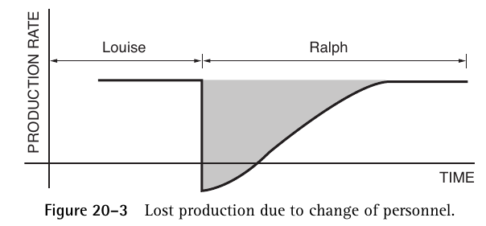
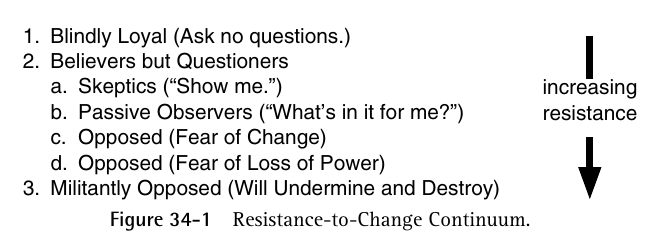
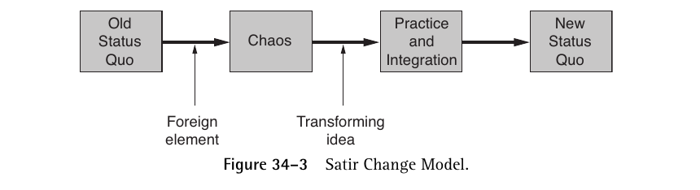
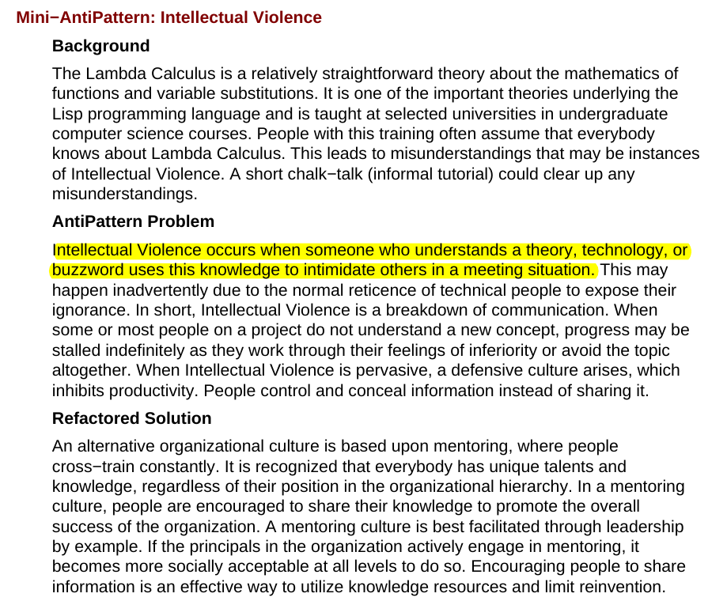

# Antipatterns

# Chapter 5

- Inclusion of a refactored solution
- Antipatterns define a migration or refactoring of negative solutions to positive solutions

# Software Refactoring

- Software refactoring is a form of code modification which is used to improve the software structure in support of subsequent extension and long term maintenance
- Its goal is to transform code without impacting correctness
- There are different types of abstraction
    - Superclass abstraction (two or more similar classes)
    - Conditional elimination (structure and behavior is dependent upon a conditional statement)
    - Aggregate abstraction (reorganize class relationships to improve their structure and extensibility)

# Development

## The Blob

Procedural style design leads to one object with a lion's share of responsibilities.

Monolithic codebase

If you make a change to the blob then 

## Continuous Obsolencence

Technology is changing so rapidly that developers often have trouble keeping up with current versions of software.

## Lava Flow

Dead code and forgeten design information is frozen in an ever-changing design.

## Ambiguous Viewpoint

Object-oriented analysis and design models are often presented without claryfying the viewpoint represented by the model.

## Functional Decomposition

Output of experienced, nonobject-oriented developers who design and implement an application in an object-oriented language.

## Poltergeists

Poltergeists are classes with very limited roles and effective life cycles. They often start processes for other objects.

## Boat Anchor

A boat anchor is a piece of software or hardware that serves no useful purpose on the current project.

## Golden Hammer

A Golden Hammer is a familiar technology or concept applied obsessively to many software problems.

## Dead End

A Dead End is reached by modifying a reusable component if the modified component is no longer maintained and supported by the supplier.

## Spaghetti Code

Ad hos software structure makes it difficult to extend and optimize code.

## Input Kludge

Software that fails straightforward behavioral tests may be an example of an input kludge.

## Walking through a Minefield

Using today's software technology is analogous to walking through a high-tech mine field. Numerous bugs are found in released software products.

## Cut-and-Paste Programming (Cargo Culting)

Code reused by copying source statements leads to significant maintenance problems.

## Mushroom Management

Micromanagement by keeping developers away from the end users.

# Peopleware

Playing Well with Others

- Trust women
- The capacity of the team has to absorb newness

- Technology is around you now but not when you were growing up
- We are trying to constantly multitask

# Human Capital - Chapter 20

- Utilities are paid to keep you comfortable at work
- Expenditures for different types of equipment can be treated as expenses or as assets
- An *expense* is money that gets used up. That money is gone.
- An *investment* is use of an asset to purchase another asset
- The value has not been used up, only converted from one to another
- You capitalize expenditures when you treat investments as expenses

## How About People?

- All salaries are treated as expense, never as capital investment
- What if you send a worker off to a seminar? His salary and seminar fees have been spent on something that isn't "gone."

## Who cares?

- The IRS does, and so do the stockholders
- The way we think about our expenditures could lead managers toward actions that fail to preserve the value of an organization's investment

## Assessing the Investment in Human Capital

- How much does your company invest in you and your colleagues?
- What happens when you lose an expert like Louise?
- Ralph needs to do a lot of stuff - filling out forms for health insurance, learning how to order-in lunch, getting supplies, configuring workstation, etc. net production is zero
- Production rate is low

## What about the ramp-up time for an experienced worker?

- Takes more than two years to bring a new worker up to speed
- Client only hires people who have a firm grasp of the underlying technology
- You need to become a valuable resource

## Playing Up to Wall Street

- The object of the exercise is upsizing, not downsizing
- Wall Street takes the investment in people as an expense. Companies that play this game will suffer in the long run.

# The Whole is Greater Than the Sum of the Parts

There is a phenomenon called *jell,* which is identifiable team spirit.

## Concept of the Jelled Team

- A jelled team is a group of people so strongly knit that the whole is greater than the sum of the partsx
- They've got *momentum*
- Teams are formed around goals. Individuals on the team might have a diversity of goals prior to jelling
- They will all go towards a common goal, which they pursue with enormous energy

## Management by Hysterical Optimism

- They find it distasteful for getting workers to accept corporate goals
- Why would we need to form elaborate social units around it?
- If your staff isn't enthusiastic, then you'd be disappointed

## The Guns of Navarone

- Arbitrariness of goals doesn't mean that no one is going to accept them.
- Goals in sports are arbitrary
- There is an involvement of social units, people care about outcomes
- People are psyched just to pass version 3 acceptance test of pension trust system
- Manager who is motivated toward goal attainment is likely to observe that teams don't attain goals; people on the teams attain goals. Most of the work is done by individuals working alone.
- *The purpose of a team is not goal attainment but goal alignment*

## Signs of a Jelled Team

- Jelled teams are usually marked by a strong sense of identity
- Teammates may all use the same catch phrases and share many in-jokes.
- There may be team space, but the teams may congregate at lunch or hang out at the same watering whole after work
- There is a sense of eliteness on a good team. Team members feel they're part of something unit. They have a cocky SWAT team attitude
- There is a feeling of joint ownership of the product built by the jelled team

## Teams and Cliques

- Teams are good, and cliques should be avoided
- A cool current of air (a breeze), is delightful, an annoying current of air (a draft), is annoying
- Cliques are a sign of managerial insecurity
- Jelled work group may be cocky and self sufficient, irritating and exclusive, but it does more to serve the manager's real goals than any assemblage of interchangeable parts could ever do

# Ambiguous Viewpoint Antipattern

- Business viewpoint, specification viewpoint and implementation viewpoint
- The business viewpoint defines the user's model of the information and processes

## Functional Decomposition

- No OO antipattern
- Nonobject-oriented developers who design and implement an application when developers are comfortable with a main routine that calls numerous subroutines
- Something incredibly complex is produced
- Classes with a single action as a function
- No hope of ever obtaining software reuse
- **Caused by lack of object oriented understanding, lack of architecture enforcement. People wanna find a way to monkey-patch or fudge their way through something that they don't know**

**Solutions**

- Combine several classes together
- Rewrite functions
- Take a bottom-up refactoring of all the classes

## Spaghetti Code Antipattern

- Ignorance and sloth are what causes this
- The solution is software refactoring and code cleanup
- Code strucuture lacks clarity
- Object methods have no parameters
- Inexperience with object oriented design technologies
- No mentoring or ineffective code reviews
- No design prior to implementation
- Result of developers working in isolation

**Related Solutions**

- Analysis Paralysis - produced a detailed design without ever reaching a point at which implementation can commence
- Lava Flow - code base had some logical purpose at some point but portions became obsolescent but still remained as part of the code base

## Input Kludge

Software the fails straightforward behavioral tests are Input Kludge - if the program accepts free text from the user, the algorithm will handle many combinations of legal and illegal input strings incorrectly

Use production-quality input algorithms

Use a feature matrix

Blackbox testing - try to make your program crash

## Walking through a Mine Field

Numerous bugs occur in released software products. Code will require two or more changes per line to remove all defects. Without question, many products are released well before they are ready to support operational systems. A knowledgeable software engineer states that there are no real systems, not even ours.

Commercial software testing is to limit risks and support costs.

Every time an end user contacts a vendor for technical support, most or all of the profit margin is spent answering the call.

Investment in testing is good. The size of the testing staff exceed programming staff in some cases. A typical system can require five times as much test-case software as production software. Test software is more complex than production software because it requires a lot of management.

> Is the reason why we're paying for support is because you guys have a defective product?

## Cut-and-Paste Programming

Cargo culting

# 22 - The Black Team

There was a company that was a poor sport about software delivered with bugs.

The company trained ccustomers to be tolerant of bugs, but they decided to get rid of the bugs.

Programmers were rather too inclined to believe the best of their programs and couldn't find the bugs themselves.

Testers did the final testing on critical software before it was sent to the customers.

The Black team was made of people who proved themselves to be slightly better at testing than their peers and were more motivated. They were free of cognitive dissonance that hampers developers when testing their own programs.

The Black Team improved during the next year - magic was happening as the team was forming a personality of their own. 

Some teams love to see code that fails. They **overtested**, by overloading buffers, etc. They became nasty. **Every defect the team found was one that the customers couldn't find.**

The Black Team, with its original members leaving, survived the loss and emerged with its energy and personality intact.

# Teamcicide

- It's hard to make teams jell
- The process is much to fragile to be controlled
- Don't build teams, grow them. It's like agriculture
- Team inversion - look for ways to achieve the exact opposite of your goal
    - Defensive management
        - You can't protect yourself against your own people's incompetence. You need to trust the team.
    - Bureaucracy
        - Paperwork and mindless paper pushing.
    - Physical separation
        - Hard to get people into adjacent space.
    - Fragmentation of people's time
        - Bad for efficiency because people can only keep track of so many human interactions. They take time changing gears. No one can be a part of multiple jelled teams
    - Quality reduction of the product
        - Product in less time = less quality and less cost
        - People who are developing a shoddy product woun 't look each other in the eye
    - Phony deadlines
        - Phony deadlines used to work. People don't do a stroke of work unless under duress. Don't expect a jelled team to work on that project
    - Clique control
        - There may be an explicit policy that teams
        - Low consciousness of teams in upper management
    - It's normal to kill teams.

## Cut-And-Paste Programming

- People who copy paste code without understanding what it really is

## Mushroom Management

- Always involve the user when building the system, so that you understand changing requirements
- Because we only encounter changes until system delivery, then we will incur more costs compared to if we found them as we were developing

# Software Architecture Antipatterns

## Autogenerated Stovepipe

When migrating an existing software system to a distributed infrastructure, an autogenerated stovepipe arises when converting the existing software interfaces to distributed interfaces. If the same design is used for distributed computing, a number of problems emerge.

Interfaces should be reengineered. Design is independent of particular subsystems.

## Stovepipe Enterprise

A Stovepipe system is characterized by a software structure that inhibits change. The refactored solution describes how to abstract subsystem and components to achieve an improved system structure. The stovepipe enterprise antipattern is characterized by a lack of coordination and planning across a set of systems

**Symptoms**

- Incompatible terminology
- Monolithic system
- Lack of software reuse  between enterprise systems
- Lack of interoperability between enterprise systems

**Solution**

- Define better standards and protocols

## Jumble

When horizontal and vertical design elements are intermixed, an unstable architecture results. The intermingling of horizontal and vertical design elements limits the reusability and robustness of the architecture and the systeem software componenets

- Add vertical elements as extensions for specialized functionality and for performance
- Incorporatet metadata
- Trade off the static elements of the design with the dynamic elements

## Stovepipe System

Subsystems are integrated in an ad hoc manner using multiple integration stratgies, point-to-point. The integration approach for each pair of subsystems is not easily leveraged toward that of other subsystems. The stovepipe system antipattern is single-system analogy of stovepipe enterprise and is concerned with how the subsystems are coordinated with a single system.

**Solution**

- Make a component architecture that provides for flexible substitution of software modules. Subsystems are modeled abstractly so that there are many fewer exposed interfaces.

## Cover Your Assets

Document driven software processes often produce less than useful requirements and specifications because the authors evade making important decisions. In order to avoid making a mistake, the authors take a safer course and elaborate upon alternatives.

**Solution**

- Have more architectural blueprints

## Vendor Lock-in

Vendor lock-in occurs in systems that are highly dependent upon proprietary architectures. The use of architectural isolation layers can provide independence from vendor-specific solutions.

**Solution**

- Provide an isolation layer
- Use Kubernetes (you can write a script that is deployable over multiple clouds to avoid vendor lock in)
- Abstract more

## PW24 - Teamicide Revisited

Teamicide happends when you demean work or demean the people who do the work. There are *motivational accessoreis* that are a form of triumpth ofver substance.

Teamwork is the fuel that allows common people to attain uncommon results.

## Overtime: An Unanticipated Side Effect

Damage to team cohesion is bad - extended overtime is a productivity-reduction technique because the extra hours are offset by negative side effects.

# PW25 - Competition

Compeition within a team or work group is complicated and something that managers tend to disagree about.

Highly competitive siblings tend to grow up to be distanced from each other while those who are less competitive as children hae at least a chance of building warm sibling friendships as adults.

The importance of coaching is important because it is an important factor in successful team interaction.

# PW33 - Evil Mail

Don't spam people

Make your email productive

Silence implies consent

People don't like change

Niccolo Machiavelli and The Prince, longest job application

# Antipatterns Chapter 7

## Corncobs

Corncobs are difficult people who are prevalent in the software development business. Usually due to ego, personal motivations, for recognition or monetary incentives.

Basically they're difficult people.

You can:

- Transfer the responsibility (give the corncob the responsibility)
- Isolate the issue by considering the opinion and giving both sides. Do straw polls and never take anything personally
- Question the question to help them clarify their meaning

## Intellectual Violence

Don't fucking bully people.

## Irrational Management

Everything about the project is traced back to the personality of the person who is running the project.

- Admit you have a problem and get help.
- Understand the development staff.
- Provide clear, short-term goals.
- Share a focus
- Look for process improvement
- Facilitate communication

## Project Mismanagement

Death By Planning - key activities are overlooked or minimized

- Inability to manage mangers, dev processes and development staff
- Cannot make decisions
- Fears success
- Is ignorant of the true state of the project activities and deliverables

Use technical backups. When showing a commercial product, have competent engineers attend the vendor's training course. Add guarantees for new products like merchantability.

## Smoke and Mirrors

End user believes that capabilities can be delivered when in fact they cannot.

Throw it over the wall - code is finished but no testing or documentation

Fire Drill - technopolicital issues are present

"Wait until management is desparate, and they will accept anything that you give them"

Use sheltering - create and maintain two alternative project environments, one internal and one external. 

# PW35 - Organizational Learning

Experience doesn't matter if you don't learn from it.

Organizational change happens with middle-managers.

Hard to create a team of managers because they have their own egos to deal with; once something gets done, the credit goes to just one of them

## PW36 - The Making of Community

Most people's community comes from their workplace

Dangerous to avoid it

What will your legacy be when you're lying on your deathbed?